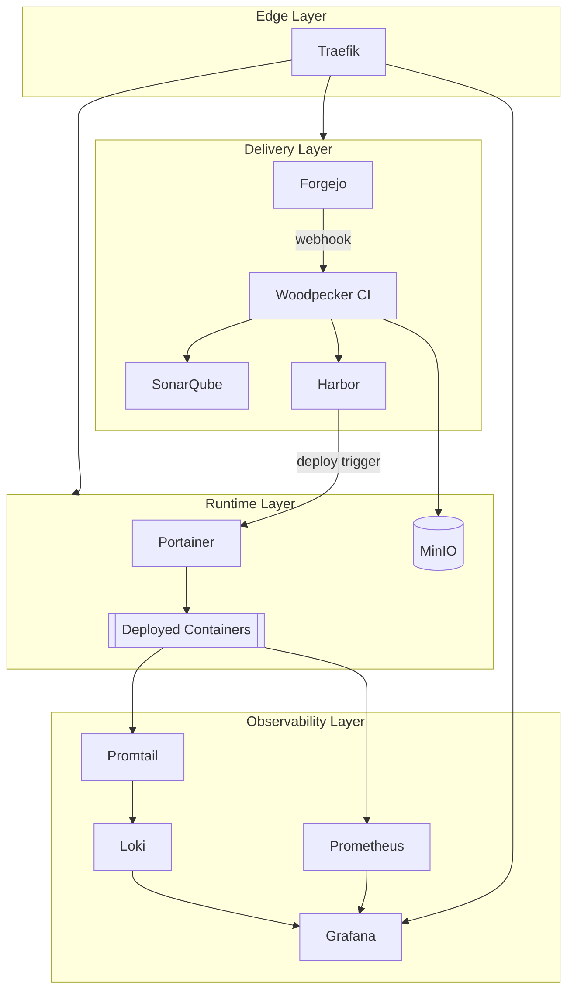

# Architecture

## Overview

The platform is organized into four layers. Every web-facing service sits behind a single reverse proxy (Traefik), so there is one entry point, one place TLS is terminated, and one place routing rules live.

## Layer by layer

### 1. Edge layer — Traefik

Traefik is the single ingress point for the whole platform. It watches the Docker socket, auto-discovers services via container labels, and handles:

- Routing `git.example.com`, `ci.example.com`, `registry.example.com`, etc. to the right container
- Automatic TLS certificate issuance and renewal (Let's Encrypt / ACME)
- Middleware: rate limiting, basic auth on internal-only dashboards, HTTP→HTTPS redirect

No other service needs to know about ports or TLS — it just joins the Traefik Docker network and gets labeled.

### 2. Delivery layer — Forgejo → Woodpecker → SonarQube → Harbor

This is the CI/CD path:

1. A developer pushes a commit or opens a PR against a repo hosted on **Forgejo**.
2. Forgejo fires a webhook to **Woodpecker CI**, which picks up the pipeline defined in `.woodpecker.yml` in the repo.
3. The pipeline runs, typically:
   - Install deps, run unit tests
   - Run **SonarQube** static analysis; the pipeline fails the build if the quality gate (coverage, duplication, code smells, known vulnerability patterns) isn't met
   - Build the container image
   - Push the image to **Harbor**, which scans it for CVEs (via its built-in Trivy scanner) before allowing it to be pulled by anything downstream
4. On success, Harbor (or Woodpecker directly) calls a deploy hook against Portainer.

### 3. Runtime layer — Portainer, deployed apps, MinIO

**Portainer** is the operational control plane for everything running on the Docker host(s): it redeploys stacks when a new image lands in Harbor, gives a UI for container logs/exec/restart, and manages the Traefik-labeled networks the apps join.

**MinIO** provides S3-compatible object storage used for build artifacts, database backups, and any application that needs blob storage — without paying for or depending on AWS S3.

### 4. Observability layer — Prometheus, Grafana, Loki, Promtail

- **Prometheus** scrapes metrics from every container (via `cadvisor`/`node-exporter`) and from instrumented applications directly.
- **Promtail** ships container logs to **Loki**, which indexes them by label the same way Prometheus indexes metrics.
- **Grafana** is the single pane of glass: dashboards pull from both Prometheus (metrics) and Loki (logs), so a dashboard panel and its underlying logs are one click apart.

## Network topology

All services share one Docker bridge network (`edge`) that Traefik is attached to; back-end-only dependencies (databases, Redis) sit on a second, internal-only network that Traefik never touches. This keeps the attack surface at the edge to exactly the services meant to be public.

## Design decisions worth calling out

- **Why Woodpecker over Jenkins/Drone**: Woodpecker is Drone's community-maintained fork — lightweight, YAML-native pipelines, and a small footprint appropriate for a self-hosted box rather than a dedicated CI cluster.
- **Why Forgejo over Gitea**: Forgejo is Gitea's community fork, governed as a non-profit project — chosen to avoid dependency on a single commercial entity's roadmap.
- **Why Harbor over a bare registry**: Harbor adds RBAC, image signing, replication, and vulnerability scanning on top of the OCI registry spec — the difference between "a place to push images" and an actual artifact management system.
- **Why Loki instead of the ELK stack**: Loki only indexes metadata (labels), not full log text, which makes it dramatically cheaper to run at small scale while still integrating natively with Grafana and Prometheus's label model.
