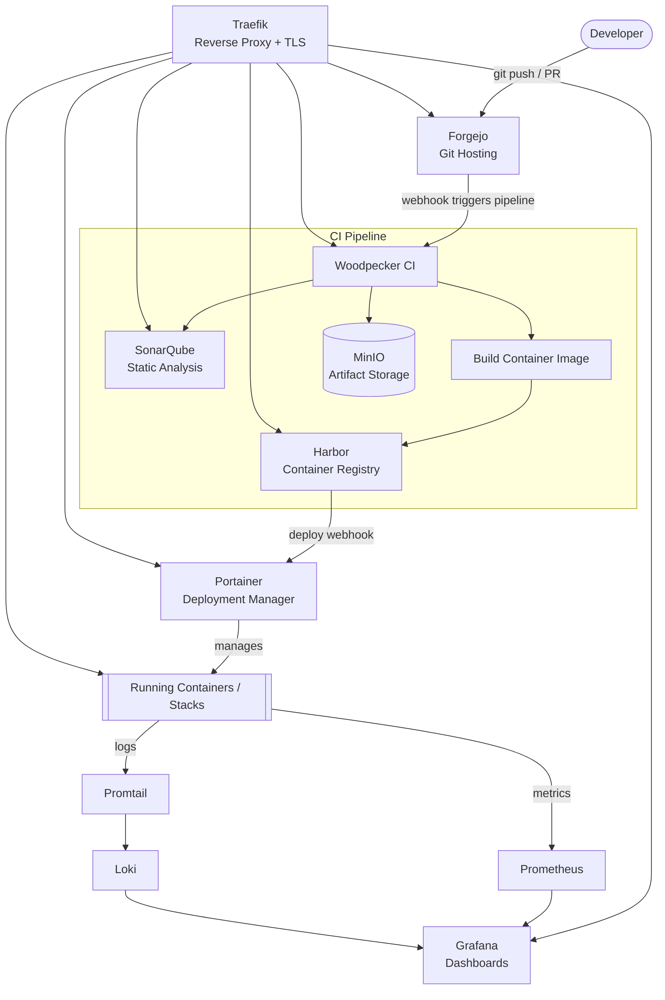

# Forge Stack — A Self-Hosted DevOps Platform

A reference architecture and documentation project for a fully open-source, self-hosted **Internal Developer Platform (IDP)** — covering git hosting, CI/CD, container registry, deployment management, observability, and code quality, with zero dependency on proprietary SaaS tooling.

**[View the project page →](https://claude.ai/code/artifact/d5dbd790-a258-4131-88b8-10c0b587a2c4)**

> **Status:** Deployed and proven, not just documented. Every config in [`deploy/`](deploy/) has been run for real on a VM: all nine services are up behind Traefik with real TLS certificates, and a small [demo application](demo-app/) has been pushed through the full pipeline end to end — Forgejo received the push, Woodpecker ran its tests and triggered a SonarQube quality gate (passed), built a container image, and pushed it to Harbor, where Trivy scanned it for CVEs (79 found in the base image, 0 in the app itself — zero dependencies). Several real bugs surfaced only at deploy time — a stale container registry, an HTTP/HTTPS scheme mismatch breaking OAuth, a Traefik router ambiguity, a Postgres credential reset that silently no-oped against a bind-mounted volume, a CI plugin permissions change, a Harbor robot account whose real name didn't match the documented naming convention — and every one of them is fixed in the config here, not worked around by hand on a server. Full account of what broke and how it got fixed: [`demo-app/README.md`](demo-app/README.md) and [`deploy/harbor/README.md`](deploy/harbor/README.md).

## Why this project

Most companies stitch together GitHub, GitHub Actions, Docker Hub, Datadog, and a handful of SaaS tools to get a working DevOps platform — each with its own bill and its own vendor lock-in. This project asks: **what does the same platform look like built entirely from open-source components you can self-host?**

The answer is nine tools, wired together so that a `git push` flows all the way through to a running, monitored, security-scanned deployment without leaving infrastructure you control.

## Architecture



**The flow in one sentence:** code is pushed to Forgejo, Woodpecker CI lints and tests it, SonarQube gates it on quality, the image is built and pushed to Harbor (scanned for CVEs), Portainer redeploys the updated stack, Traefik routes and TLS-terminates every service, and Prometheus/Grafana/Loki give full visibility into what's running.

Full write-up: [docs/architecture.md](docs/architecture.md)

## Tech stack

| Tool                                            | Role                                              | Replaces (SaaS equivalent) |
| ----------------------------------------------- | ------------------------------------------------- | -------------------------- |
| [Forgejo](docs/tools/forgejo.md)                 | Git hosting, PRs, issues, webhooks                | GitHub / GitLab            |
| [Woodpecker CI](docs/tools/woodpecker.md)        | CI/CD pipeline runner                             | GitHub Actions / CircleCI  |
| [Harbor](docs/tools/harbor.md)                   | Container registry + image vulnerability scanning | Docker Hub / ECR           |
| [Portainer](docs/tools/portainer.md)             | Container & stack management UI                   | —                         |
| [SonarQube](docs/tools/sonarqube.md)             | Static analysis & code quality gates              | SonarCloud / CodeClimate   |
| [Prometheus + Grafana](docs/tools/monitoring.md) | Metrics collection & dashboards                   | Datadog / New Relic        |
| [Loki + Promtail](docs/tools/logging.md)         | Log aggregation & search                          | Datadog Logs / Splunk      |
| [MinIO](docs/tools/minio.md)                     | S3-compatible object storage                      | AWS S3                     |
| [Traefik](docs/tools/traefik.md)                 | Reverse proxy, automatic TLS, service discovery   | NGINX + Certbot / an ALB   |

## Deploying

```bash
cd deploy
cp .env.example .env    # set DOMAIN + every credential — see comments inline
docker compose up -d traefik postgres forgejo sonarqube portainer minio \
  node-exporter cadvisor prometheus loki promtail grafana
```

Works as-is with `DOMAIN=localhost` on a local Docker install, or `DOMAIN=example.com` plus `docker-compose.tls.yml` on a VM for automatic HTTPS. Woodpecker and Harbor need two short manual steps (an OAuth app registration and a separate installer, respectively) — full walkthrough and the access-URL table for every service: [`deploy/README.md`](deploy/README.md).

## Documentation

- [Architecture](docs/architecture.md) — how the nine services connect, data flow, network topology
- [Setup approach](docs/setup.md) — deployment model and what's in `deploy/`
- [deploy/README.md](deploy/README.md) — the actual bring-up steps, bootstrap order, and access URLs
- Per-tool docs — see the table above, or browse [docs/tools/](docs/tools/)

## What this project demonstrates

- Designing a multi-service platform architecture from independent open-source components
- CI/CD pipeline design (build → scan → publish → deploy)
- Reverse proxying, service discovery, and automatic TLS at the edge
- Observability: the metrics/logs/dashboards triad (Prometheus, Loki, Grafana)
- Container registry security (vulnerability scanning, image promotion)
- Static analysis and code quality gating in a pipeline
- Trade-off reasoning between self-hosted infrastructure and managed SaaS
- Writing deployable Docker Compose (networks, secrets, health checks, multi-database Postgres) for a real, multi-service stack — not just diagrams of one
- Debugging a real deployment under real constraints: DNS propagation and Let's Encrypt rate limits, Traefik router/service ambiguity, OAuth redirect-URI mismatches, a Postgres credential reset that silently no-oped against a bind-mounted volume instead of a Docker-managed one, and a CI platform's default security posture blocking a build step until explicitly allow-listed

## Repo structure

```
.
├── readme.md
├── docs/
│   ├── architecture.md
│   ├── setup.md
│   └── tools/
│       ├── forgejo.md
│       ├── woodpecker.md
│       ├── harbor.md
│       ├── portainer.md
│       ├── monitoring.md      (Prometheus + Grafana)
│       ├── logging.md         (Loki + Promtail)
│       ├── minio.md
│       ├── sonarqube.md
│       └── traefik.md
├── demo-app/                   mirror of the sample app proving the CI/CD path works
│   ├── README.md                real gotchas hit deploying it, redeploy steps
│   ├── index.js
│   ├── .woodpecker.yml          the actual, verified-working pipeline
│   └── test/
└── deploy/
    ├── README.md               quickstart, bootstrap steps, access URLs
    ├── docker-compose.yml      base stack (HTTP, DOMAIN=localhost-ready)
    ├── docker-compose.tls.yml  overlay for a VM deployment (HTTPS via Let's Encrypt)
    ├── .env.example
    ├── postgres/                includes the nightly Postgres -> MinIO backup job
    ├── prometheus/
    ├── loki/
    ├── promtail/
    ├── grafana/provisioning/    datasources + a live dashboard, both auto-loaded
    ├── apps/demo-app/           the demo app's own deployment stack (Portainer)
    └── harbor/README.md        Harbor's separate installer + real gotchas hit running it
```
